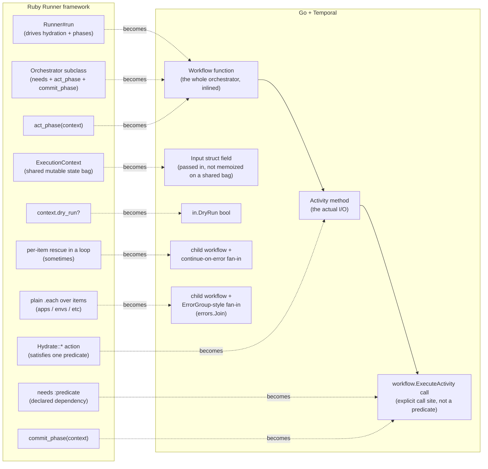

# Ruby-Runner → Go+Temporal: a reusable migration playbook

**Why this doc exists**: this repo is a from-scratch Go+Temporal rebuild of a Ruby ETL/GitOps tool
that used a hand-rolled `Runner`/`Orchestrator`/predicate framework (see `ruby-legacy/` for the
frozen original, [AGENTS.md](../AGENTS.md#ruby--go-file-map) for the exact file-by-file
map). The plan is to do the same kind of migration again later, on a different, real Ruby deploy
tool at work. That tool isn't this tool - the domain, the orchestrators, the external services will
all differ - but the *shape* of the migration won't. This doc pulls the reusable part out of the
repo-specific part: a concept map, a process, and a set of gotchas that generalize past this
specific codebase. Read it before starting that migration, alongside skimming this repo's actual
code as the worked example.

**What's specific to this repo and won't transfer directly**: the domain (Kubernetes manifests,
ArgoCD, 1Password, Keycloak, Talos), the exact five workflows, the exact config schema. **What
should transfer**: the concept mapping below, the migration order, and every lesson in "Gotchas."

## 1. The concept map

Any Ruby tool built around a `Runner` that hydrates shared state to satisfy declared predicates,
then walks a list of orchestrators through ordered phases, maps onto Temporal's primitives fairly
mechanically once you see the correspondence. This repo's original framework
(`ruby-legacy/app/workflow/{runner,orchestrator,execution_context}.rb`) is the concrete example
behind every row below.

| Ruby concept | Go/Temporal equivalent | Why |
|---|---|---|
| `Runner#run` (drives hydration, then act, then commit) | The workflow function's own top-to-bottom code | Temporal's replay model already gives you "do these steps in this order, durably" for free - there's no need for a generic driver object. Each workflow just *is* its own sequence. |
| An `Orchestrator` subclass | A workflow function (`func XWorkflow(ctx workflow.Context, in XInput) (XResult, error)`) | One Ruby class per job maps to one Go function per job. There's no base class to subclass - workflow functions are ordinary functions, not methods on a shared type. |
| `needs :predicate` + `HYDRATION_ACTIONS` lookup | A direct `workflow.ExecuteActivity` call for exactly the data needed, at the point it's needed | The predicate system exists in Ruby to let multiple orchestrators share hydration work and skip it if already satisfied. In Temporal, activity *results* aren't memoized across workflow runs (each workflow execution is independent), so this collapses to "call the activity where you need its result." If two workflows need the same extraction, that's two activity calls in two workflows - which is fine, since activities are cheap to call and idempotent extraction is safe to repeat. |
| A `Hydrate::*` action (an object with a `.call(context)` that mutates shared state) | An **activity method** (`internal/activities/activities.go`) | Both are "the effectful step." The difference: an activity's *result* comes back as a return value, not a side effect on a shared mutable bag - see the next row. |
| `ExecutionContext` (mutable state bag threaded through every phase, accumulating `apps`, `saml_credentials_by_env`, etc. as instance variables) | An `Input` struct per workflow/activity call, plus local variables in workflow code | This is the biggest structural shift. Temporal workflow code **must be deterministic and replayable**, which rules out a long-lived mutable object accumulating state across many non-deterministic steps in the way Ruby does it freely. Instead: activity results come back as typed return values, get assigned to local variables, and get passed explicitly to whatever needs them next. More verbose; much easier to trace data flow by reading the function top to bottom. |
| `context.dry_run?` (an option read from a shared bag, checked wherever relevant) | A `DryRun bool` field on the workflow's `Input` struct, checked at the one or two points that matter | Same idea, just passed as ordinary function input instead of pulled from ambient shared state. |
| `act_phase` / `commit_phase` as two separately-dispatched methods across every orchestrator | Ordinary sequential code within one workflow function - no separate dispatch step | Ruby's Runner calls `act_phase` on every orchestrator, then `commit_phase` on every orchestrator, as two full passes - because multiple orchestrators' act phases might need to interleave before any of them commits. If each Go workflow is scoped to one job (matching one orchestrator), there's no cross-orchestrator interleaving to preserve, so this collapses to "just write the code in order." |
| A per-item `rescue` inside a `.each` loop (isolate one item's failure, keep processing the rest) | A child workflow per item + a fan-in loop that logs-and-continues past a failed future | See §3 of this doc and `docs/GO_NOTES.md`'s "Decomposing the monolith" section - `SetupKeycloakWorkflow` is the worked example. |
| A plain `.each` loop with no error isolation (first failure aborts everything) | A child workflow per item + a fan-in loop using `errors.Join` to collect every failure before returning | The worked example is `SyncWorkloadsWorkflow`/`Sync1PasswordWorkflow` - same "any failure fails the whole run" contract as the loop, but every item still gets a chance to finish instead of the run stopping dead at the first failure. |

## 2. The migration process

A concrete order that worked here, general enough to repeat:

1. **Inventory every orchestrator and every hydration action** in the Ruby original. List them with
   their `needs`, and note which phase (`act_phase` vs `commit_phase`) does the real work - that's
   your dry-run boundary in the port (see the row above).
2. **One Go workflow function per orchestrator**, one Go activity method per hydration action *and*
   per write/commit step. Resist merging unrelated orchestrators into one workflow just because
   they're small - keeping the 1:1 mapping makes the "does this match the original?" review much
   easier, and each becomes its own CLI command / Web UI entry naturally.
3. **Config loads on the worker, never the client.** If there's any possibility of running the
   workflow starter (CLI, web trigger, whatever) and the worker as separate processes/machines -
   which is the entire point of a real Temporal deployment - config (especially filesystem paths)
   must load inside a `LoadConfig`-style activity that every workflow calls first, never be loaded by
   whatever process merely *starts* the workflow and threaded in as workflow input. See the doc
   comment on `activities.Activities.LoadConfig` in this repo, and §3 of `AGENTS.md`'s
   "Architecture: Workflow Contract." This is easy to get wrong on a first pass (it was wrong here
   too, before a review caught it) because it works perfectly in any all-in-one-process test/demo
   setup and only breaks once client and worker are actually different machines.
4. **Find the non-idempotent side effects** (anything like "create," not "create-or-update") and
   give them a non-retrying activity options context (`MaximumAttempts: 1`). Default Temporal retry
   policies assume retrying is safe; a bare `op item create`, or equivalent, is not. Grep the Ruby
   original for anything that shells out to a `create`-only CLI verb or POSTs to a creation-only API
   endpoint - those are your candidates.
5. **Find the genuine per-unit boundaries** (per-app, per-environment, per-whatever the tool
   iterates over) and decide, for each, whether a child workflow earns its keep - see §3 below and
   `docs/GO_NOTES.md`'s "Decomposing the monolith" / "When not to decompose" sections. Don't do this
   in the first pass; get a working linear port first, then decompose once you can see which loops
   actually carry payload-size or isolation risk.
6. **Audit every activity result and workflow input for secret material.** This is not the same
   check as step 4. Temporal records every activity's input and result, and every workflow's input
   and result, in its durable event history - visible via the Web UI/API/DB in external/durable mode
   - whether or not anything downstream ever reads that particular field. If the Ruby tool's
     hydration step ever pulled back a real credential, API key, or secret payload (not just a
     reference/ID to one), find every activity in the port that returns it and every workflow input
     that carries it, and make sure it never needs to. Two concrete techniques, both used in this
     repo (see `docs/GO_NOTES.md`'s "Temporal's event history is not a secrets vault" section for the
     worked examples): bundle extraction and use of a secret into **one activity call** so the value
     never has to travel between two calls as a return value/argument, and split any config-loading
     activity that bundles a credential in with unrelated general config into **two activities**, so
     the credential only ever appears in the one workflow that actually consumes it. If neither
     restructuring is practical, Temporal's `PayloadCodec` (payload encryption, configured on both
     client and worker) is the supported fallback - budget for it if the new tool's secrets can't be
     kept inside single activity calls the way this one's could.
7. **Port the test suite 1:1 where you can.** RSpec `expect(...).to eq(...)` assertions on
   orchestrator behavior translate fairly directly to `go.temporal.io/sdk/testsuite` workflow tests
   with mocked activities (§8 of `docs/GO_NOTES.md`) - same "given these mocked results, assert this
   final state" shape, just a different mocking API.
8. **Pin your Temporal module versions together and don't `go get -u` them independently** - `sdk`,
   `server` (if you use the embedded dev server), and `api` need to be mutually compatible, and `go
   mod tidy` alone can silently drift one ahead of what another was built against. This bit us once
   already; see §9 of `docs/GO_NOTES.md`.

## 3. When to reach for a child workflow

A short decision list, expanded on in `docs/GO_NOTES.md`:

- **Payload-size risk**: does the parent workflow accumulate more than a handful of KB of data
  *across* iterations of a loop, destined for one shared activity call at the end? If yes, and that
  data could scale with the number of iterations, split it: one child per iteration, each with its
  own bounded activity payloads.
- **Failure isolation the original code already had**: if the Ruby loop had a per-item `rescue`,
  preserve that behavior with per-item child workflows + a continue-on-error fan-in loop.
- **Independent work worth running concurrently**: if nothing about iteration N depends on iteration
  N-1 having finished, a sequential loop is leaving free concurrency on the table. Fan out, then fan
  in.
- **None of the above applies**: don't decompose. A workflow with no natural per-unit boundary, or
  whose data is small and fixed-size regardless of scale, gains nothing from being split into
  children - it's just more indirection to read through.

## 4. Gotchas worth re-reading before you hit them again

These are documented in depth in `docs/GO_NOTES.md` and `AGENTS.md`; summarized here as a
checklist to run through early in a new migration, before you rediscover each one the hard way:

- [ ] **Workflow code must be deterministic** - no direct I/O, no reading the real clock, no ranging
      over a Go map to decide what to do next (map iteration order is randomized on purpose).
      Everything effectful is an activity; everything about *order* of activity calls must be
      decided from slices/sorted data, never map iteration.
- [ ] **JSON at the activity boundary loses the int/float distinction** - Temporal's default data
      converter decodes any JSON number into `float64`. If you parse structured data (YAML, JSON)
      containing integers, decide up front whether extract+transform+render need to be bundled into
      one activity to avoid a round trip that would corrupt them.
- [ ] **Config (and anything else with filesystem paths) loads on the worker, not the client** - see
      §2 step 3 above.
- [ ] **Non-idempotent side effects need `MaximumAttempts: 1`**, not the default retry policy - see
      §2 step 4 above.
- [ ] **Large or unboundedly-scaling per-iteration payloads need child workflows**, not one
      accumulating slice passed to one final activity call - see §3 above.
- [ ] **Secret values must never appear in an activity result or workflow input if avoidable** -
      Temporal's event history records both, in plaintext, and that history is queryable through the
      Web UI/API/DB in external mode regardless of whether any workflow code actually reads that
      field back. Bundle "obtain the secret" and "use the secret" into one activity call, and split
      credential-bearing fields out of any shared config-loading activity into their own,
      narrowly-called one - see §2 step 6 above.
- [ ] **Pin Temporal's own module versions together** (`sdk`, `server`, `api`) - don't let `go get
      -u` or a bare `go mod tidy` touch them independently.
- [ ] **`gopkg.in/yaml.v3` (if you use it) decodes into `map[string]interface{}`**, not
      `map[interface{}]interface{}` (the old v2 behavior) - matters if any transformation logic
      assumes string keys.
- [ ] **Docker Compose bind-mount targets must be absolute paths inside the container** - a
      `.env`-driven relative host path (`../some-repo:../some-repo` in short syntax) fails to create
      the mount entirely; use fixed absolute container-side targets and override the worker's own
      config to match.

## 5. What's likely to differ next time

Don't assume the next Ruby tool looks exactly like this one. Things worth specifically checking for,
since they'd change the mapping above:

- **Real user interaction in `act_phase`.** This repo's `act_phase`s never actually prompted a human
  - they were pure computation. A tool that genuinely pauses for interactive input mid-run needs
    Temporal **signals** (external input delivered to a running workflow) or a human-in-the-loop
    activity pattern, neither of which this repo needed or implements. Don't copy this repo's
    "act_phase always non-interactive" assumption without checking.
- **Long-running external processes to poll.** `SetupKeycloakEnvWorkflow`'s `workflow.Sleep`-based
  polling loop is the one example here; a different tool might have several, or need `workflow.Await`
  with a signal instead of a fixed poll interval.
- **A genuinely large number of orchestrators/predicates.** This tool had five orchestrators and two
  hydration predicates - small enough that a 1:1 rewrite was tractable by hand. A tool with dozens of
  orchestrators and a deep predicate dependency graph might be worth scripting the inventory step
  (§2.1) rather than doing it by eye.
- **Different retry/idempotency shapes.** Check every external call the *new* tool makes for
  create-vs-upsert semantics fresh - don't assume the same set of activities need
  `MaximumAttempts: 1`.
